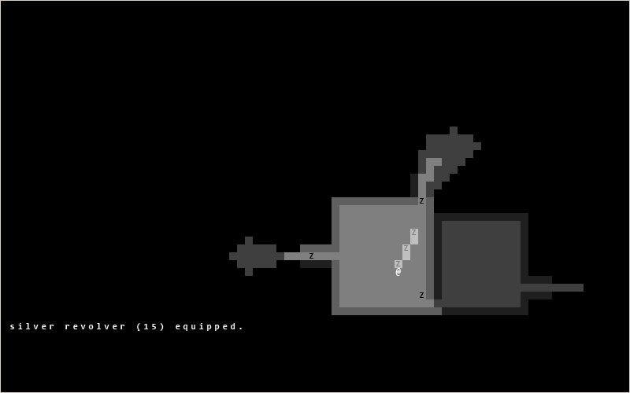

# zombierl

A simple python-based zombie roguelike.

All the content is stored in `zombie.py`, the rest is just library files.

It is written in Python 3 and you can load it simply by changing to the directory and running it.

## Keys

- `hjkl`: 90-degree movement
- `yuio`: diagonal movement
- `,`: pick up
- `.`: inventory
- `d`: drop
- `z`: shoot
- `ESC`: quit
